# Mock Data Generator (MDG 4.0)

<p align="center">
  
  
  
  
</p>

The Mock Data Generator is a full-stack application designed to produce high-quality, structured mock data using local Large Language Models. It features a sophisticated FastAPI backend that intelligently generates data, a dedicated model server for input sanitization, and a sleek React frontend to control the process.

---

## Table of Contents
- [Features](#features)
- [Architecture Overview](#-architecture-overview)
- [Core Backend Workflow](#-core-backend-workflow)
- [Technology Stack](#-technology-stack)
- [API Endpoints](#-api-endpoints)
- [Quick Start](#-quick-start)
- [Step-by-Step Setup Guide](#-step-by-step-setup-guide)
- [License](#-license)

---

## Features

The backend is packed with features to ensure high-quality data generation and a robust API.

- **🤖 AI-Powered Data Generation**: Utilizes local GGUF models via `llama-cpp-python` for flexible and context-aware data generation.
- **📊 Dynamic JSON Schema Enforcement**: Intelligently generates a JSON schema from input examples to strictly enforce the output structure of the LLM.
- **🔄 Intelligent Caching**: A multi-level caching system using Redis reduces redundant LLM calls, serving requests from cache when possible.
- **🎯 Pattern-Aware ID Generation**: A dedicated service analyzes and preserves the patterns of IDs from examples (e.g., prefixes, suffixes, data types) while ensuring uniqueness.
- **🛡️ Input Sanitization & Security**: All incoming data is sanitized through a two-stage process using to prevent prompt injection and to filter for harmful content.
- **🖼️ Automatic Image Enrichment**: Identifies fields that require image URLs and enriches them with relevant, high-quality images from the Openverse API.
- **⚡ Robust Middleware**: Includes middleware for rate limiting and request validation to ensure API stability and security.
- **📝 Structured Logging**: Comprehensive JSON-formatted logging for easy parsing and monitoring, including request/response details and performance metrics.

---

## 🏗️ Architecture Overview

The application is composed of three primary services that work in concert:

1.  **React Frontend**: The user interface for interacting with the service, built with React and TypeScript.
2.  **FastAPI Backend**: The core application logic, handling caching, ID generation, image enrichment, and orchestrating the data generation process with the LLM.
3.  **Model Server**: A separate FastAPI server dedicated to running the input sanitization models, offloading the expensive model-loading process from the main backend.

<p align="center">
  
</p>

---

## 🧠 Core Backend Workflow

The primary function of the backend is to execute the mock data generation workflow. The following sequence diagram illustrates the step-by-step process for a `POST /api/generate-mock-data` request.

<p align="center">
  
</p>

---

## 💻 Technology Stack

- **Framework**: [FastAPI](https://fastapi.tiangolo.com/)
- **Frontend**: [React](https://react.dev/) with [TypeScript](https://www.typescriptlang.org/)
- **LLM Interaction**: [llama-cpp-python](https://github.com/abetlen/llama-cpp-python) for running local GGUF models.
- **Data Validation**: [Pydantic v2](https://docs.pydantic.dev/latest/) for robust data validation and settings management.
- **Caching**: [Redis](https://redis.io/) for high-performance caching of generated data.
- **Logging Database**: [MongoDB](https://www.mongodb.com/) for storing structured logs and token usage data.
- **Async HTTP Client**: [aiohttp](https://docs.aiohttp.org/en/stable/) for non-blocking API calls.
- **Server**: [Uvicorn](https://www.uvicorn.org/) as the ASGI server.

---

## 🔌 API Endpoints

### Generate Mock Data

- **Endpoint**: `POST /api/generate-mock-data`
- **Summary**: Generates mock data based on a list of JSON object examples.
- **Query Parameters**:
  - `count` (integer, required): The desired number of mock data entries to generate.
- **Request Body**:
  - An array of JSON objects that serve as examples for the generation.
- **Success Response** (`200 OK`):
  ```json
  {
    "code": "OK",
    "message": "Response received successfully.",
    "usedFromCache": false,
    "data": [
      { "id": "user-001", "name": "Generated Name 1" },
      { "id": "user-002", "name": "Generated Name 2" }
    ],
    "error": ""
  }
  ```
- **Error Response** (`4xx` or `5xx`):
  ```json
  {
    "code": "ERROR_CODE",
    "message": "A descriptive error message.",
    "usedFromCache": false,
    "data": null,
    "error": "Detailed error information"
  }
  ```

---

## 🚀 Quick Start

For experienced developers who have all prerequisites installed (Python 3.9+, Node.js 16+, Docker, and a GGUF model file).

1.  **Clone the repository:**
    ```bash
    git clone <your-repo-url>
    cd MDG
    ```

2.  **Configure Environment:**
    - Create a `.env` file in the root `MDG/` directory.
    - Add the absolute path to your GGUF model:
      ```env
      GGUF_MODEL_PATH="/path/to/your/model.gguf"
      ```

3.  **Start Services with Docker:**
    - Make sure Docker Desktop is running.
    - Run the development startup script:
      ```bash
      ./start-dev.sh
      ```
      *(Note: You may need to make it executable first: `chmod +x start-dev.sh`)*

4.  **Access the Application:**
    - **Frontend**: [http://localhost:3000](http://localhost:3000)
    - **Backend API**: [http://localhost:8000/api/docs](http://localhost:8000/api/docs)
    - **Model Server API**: [http://localhost:8001/docs](http://localhost:8001/docs)

---

## 🛠️ Step-by-Step Setup Guide

Follow these instructions to set up the complete development environment from scratch.

### **Step 1: Prerequisites**

- **Python (3.9+):** Ensure Python is installed and accessible.
- **Node.js (16+):** Required for the React frontend. [Download here](https://nodejs.org/).
- **Homebrew (macOS only):** Recommended for installing Redis. [Installation guide](https://brew.sh/).
- **Docker (for non-macOS):** Can be used for running Redis. [Docker Desktop](https://www.docker.com/products/docker-desktop/) is recommended.
- **Git:** For cloning the repository.
- **GGUF Model File:** You need a GGUF-formatted language model. You can find many compatible models on [Hugging Face](https://huggingface.co/models?search=gguf).

### **Step 2: Clone & Configure**

1.  **Clone the Repository:**
    ```bash
    git clone <your-repo-url>
    cd MDG
    ```

2.  **Set up the Python Virtual Environment:**
    ```bash
    python -m venv .venv
    source .venv/bin/activate  # On Windows: .venv\Scripts\activate
    ```

3.  **Create the Environment Configuration File:**
    - In the root `MDG/` directory, create a file named `.env`.
    - Open it and add the following required setting. Replace the path with the *absolute path* to your downloaded GGUF model file.
      ```env
      GGUF_MODEL_PATH="/Users/yourname/Documents/models/your-model.gguf"
      ```
    - You can also add other optional settings found in `backend/src/app/config/settings.py` to this file, such as `REDIS_URL` and `MONGO_URI`.

### **Step 3: Start Redis**

Redis is used for caching. Follow the instructions for your operating system.

#### macOS (with Homebrew)

1.  **Install Redis:**
    ```bash
    brew install redis
    ```
2.  **Start the Redis service:**
    ```bash
    brew services start redis
    ```
    *To stop it later, use `brew services stop redis`.*

#### Other Systems (with Docker)

1.  **Ensure Docker Desktop is running.**
2.  **Run the Redis container:**
    ```bash
    docker run -d -p 6379:6379 --name mdg-redis redis/redis-stack-server:latest
    ```
    *This command will download the Redis image and start a container named `mdg-redis` in the background.*
    *To stop it later, use `docker stop mdg-redis`.*

### **Step 4: Install Dependencies**

1.  **Install Backend & Model Server Dependencies:**
    *With your `.venv` activated:*
    ```bash
    pip install -r requirements.txt
    ```

2.  **Install Frontend Dependencies:**
    ```bash
    cd frontend
    npm install
    cd ..
    ```

### **Step 5: Run the Application**

Now you can run the entire stack using the provided developer script.

1.  **Make the script executable (if needed):**
    ```bash
    chmod +x start-dev.sh
    ```
2.  **Run the script:**
    ```bash
    ./start-dev.sh
    ```

This script will:
- Start the **Model Server** on port `8001`.
- Start the **Backend Server** on port `8000`.
- Start the **React Frontend** on port `3000`.

Your full-stack application is now running!

---

## 📜 License

This project is licensed under the MIT License - see the `LICENSE` file for details.

## Here is the complete Documentation of my project
https://copper-pepper-543.notion.site/Documentation-2112fc3aeb488083bc9fdfcec504c4e5?source=copy_link